# Skyrunner (Godot 4)

The Godot 4 port of [Skyrunner](../skyrunner/): bush flying, weight and balance, and the long arm of
the law, on a fictional Caribbean island in 1979-86. It runs the same
**[JSBSim](https://github.com/JSBSim-Team/jsbsim)** flight dynamics, now through a C++ GDExtension, and
has everything the Python game had:
- five JSBSim aircraft with every item a point mass at its station arm
- tight strips
- the task force and its sensors, airdrops and boats, and the campaign
- co-op and versus seats over the network, and the two HQs' seasons
- the pilot bot and the balance simulators

New in the Godot build:
- **Load planner.** Pick the station for every item, set the fuel with a slider or presets (25/50/75%,
  full, or "route + 30 min"), and watch the take-off and zero-fuel CG move on the envelope, with
  endurance, range and the route's reserve.
- **HQ order menus for both sides.** The boss and the chief get navigable order lists. Each order shows
  its cost, its effect and its current state. LEFT/RIGHT sets it (which front, who to bribe, how many
  crews, which zone to patrol) and ENTER issues it.
- **A competing smuggling organisation: Los Cuervos.** A third, AI-run cartel flies its own loads every
  night:
  - It fights you for turf: where it owns the market your loads pay less.
  - It splits the task force's attention.
  - It hijacks your load if you meet it on the same route without a truce.
  - The boss can hit it, buy a truce or sell its route to the police.
  - The chief can send a gang unit after it.
  - Its planes fly in the 3D game as AI traffic.
- **On foot, first person.** TAB out of a parked aircraft and walk the apron, the hangars and the three
  headquarters. E uses what you face: the job board, the load planner at the fuel desk, the hangar
  workbench, the boss's desk (the organisation's orders) and the map table (what you know of Los
  Cuervos). F is a torch. The island, every building and the parked aircraft are solid; you climb
  kerbs and terraces but can't swim.
- **Generated islands.** `--map N` (or the lobby's island picker) grows island N: terrain, ten strips
  sited and rated for approach, and the HQs placed where each side would want them - the villa near the
  cove, the task force by the hub, the rival compound up in the hills. `--map 0` is the classic island.
- **The realism layer** (found and tuned by the scenario sweeps; details in
  [docs/BALANCE.md](docs/BALANCE.md) 14-19):
  - *Weather and the moon.* A nightly forecast both HQs see (right 75% of the time). Cloud, rain and a
    dark moon hide you; storms ground helicopters and the aerostat, keep cutters in port, and more than
    double crash risk. In the air: JSBSim wind and Dryden turbulence, rain, lightning, the moon's phase.
    Parked aircraft are tied down.
  - *Pattern of life.* The task force's analysts learn your routine: repeat a route and they expect you
    (up to +45% detection). Mixing your routes is the inspection game's answer.
  - *Canary trap.* The chief can feed a bribed dispatcher a fake patrol. Swerve around it and your man is
    arrested, so a leak is never ground truth.
  - *Rival tempers.* Los Cuervos are tit-for-tat, grudge-holders or opportunists, and you learn which
    from how they behave. Truces unravel as the season runs out (backward induction).
  - *Spare helicopters patrol.* The task force keeps one helicopter for the chase and flies every
    spare over a zone before the run - where the analysts expect you. Flag one and it joins the
    chase as a flanker, aiming ahead to cut you off; two aircraft on your tail box you in (the bust
    meter fills 50% faster). The sims showed why: one chaser already catches every runner it can
    reach, so extra aircraft pay by finding you, not by chasing harder.
  - *Nerves.* Stress follows what real smuggling pilots feared. Past the Yerkes-Dodson hump the screen
    tunnels, you hear your heartbeat and your hands shake (8-12 Hz, human hands only). A co-pilot
    steadies you.
- **One UI, redesigned.** A single theme across every screen; real tables with titled columns (the job
  board colours the landing roll against the strip length); key caps in every footer that you can
  also click; readouts as tiles; a HUD laid out by what you need when (status chips, wanted stars,
  flight tiles, job cards, fading radio toasts, and a crew strip saying what the co-pilot is doing).
  The co-pilot's desk opens on a Flight tab of crew jobs with live tiles, has a chat line to the pilot,
  and hires a spotter wherever you click a strip. ESC asks before leaving a seat. The UI scales with
  the window (tested 1024x768 to 2560x1080).
- **Graphics overhaul:**
  - chunked, LOD'd terrain with a biome splat shader (sand, grass, forest floor, dry grass, rock
    triplanar on steep faces, normal-mapped); a depth-aware sea with shoreline foam; a procedural sky
    with clouds, sun, stars and the moon; palm, broadleaf, conifer and bush MultiMeshes swaying in the
    wind; hangars, terminals, fuel desks and the three HQs as real walkable buildings with lit windows
    and lamps
  - a day/night cycle driving sun, sky and fog
  - runway edge and threshold lights, aircraft nav lights, strobes and landing lights, and police
    light bars and a searchlight at night
  - shaded terrain (rock on steep faces, detail noise, a wet shoreline) and animated water
  - MultiMesh forests, directional shadows, glow, and SSAO and volumetric fog on Forward+
  - dust on unpaved take-off rolls, boat wakes and prop discs

| Mid-afternoon on the runway (medium) | Dusk, climbing out near Eagle's Nest (high) | Night: edge lights on |
|---|---|---|
| 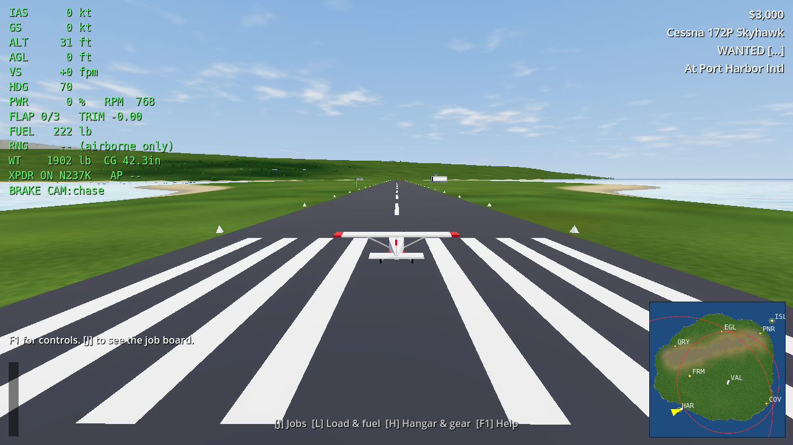 | 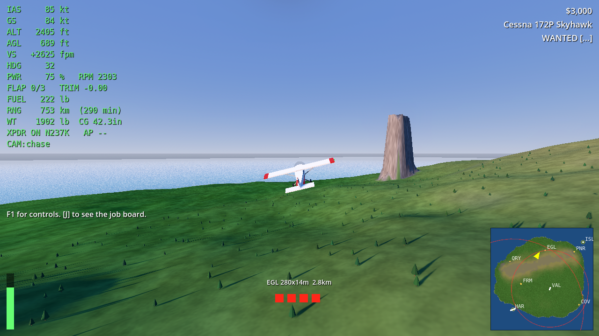 | 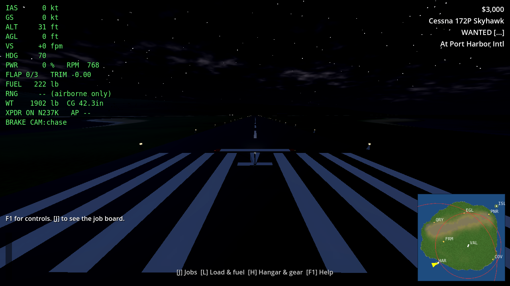 |
| **Load planner** | **Boss: the organisation's orders** | **Task-force desk** |
| 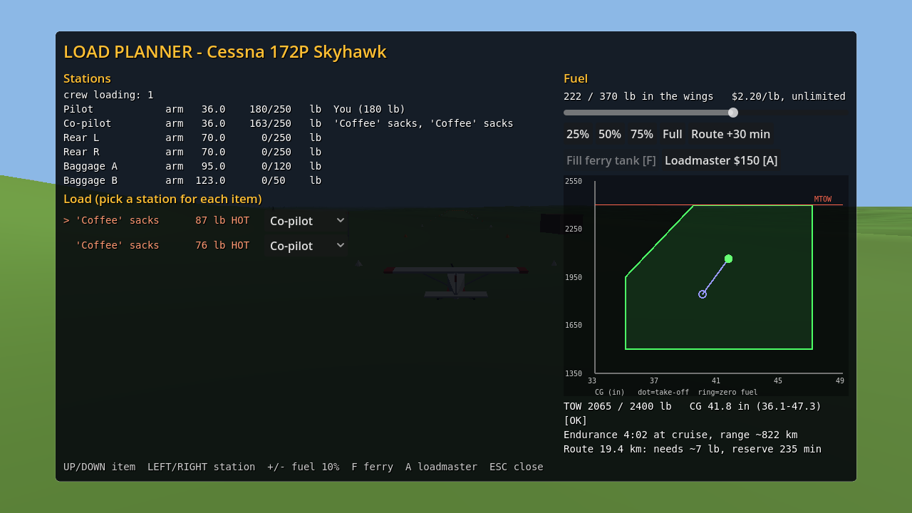 | 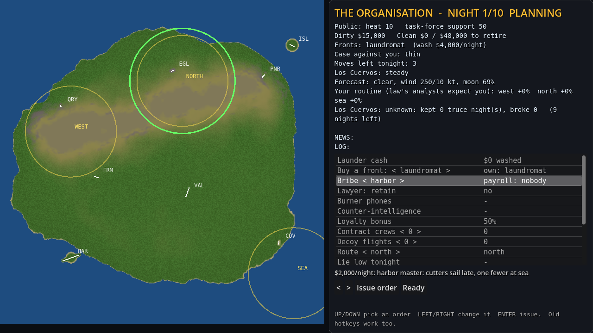 | 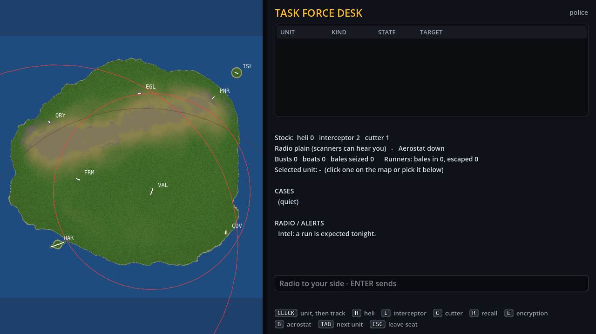 |
| **Job board** | **Chief: the task force's orders** | **Low preset** |
| 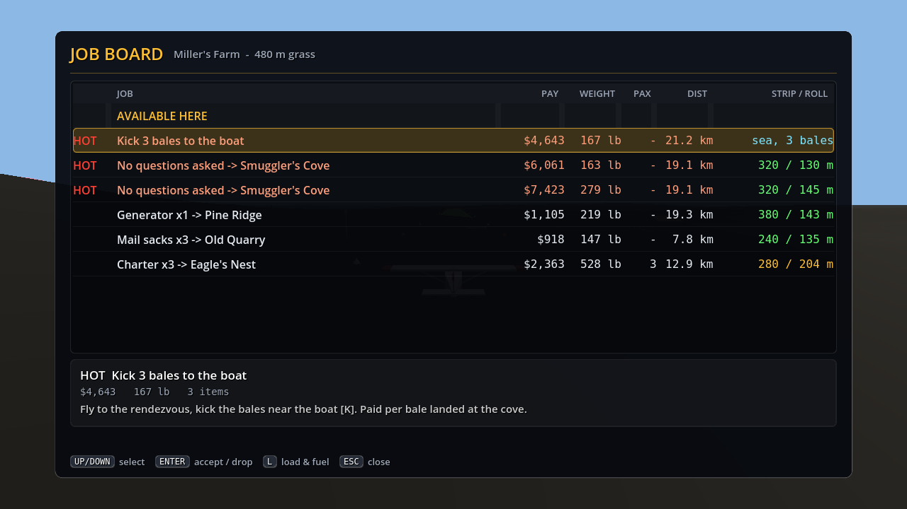 | 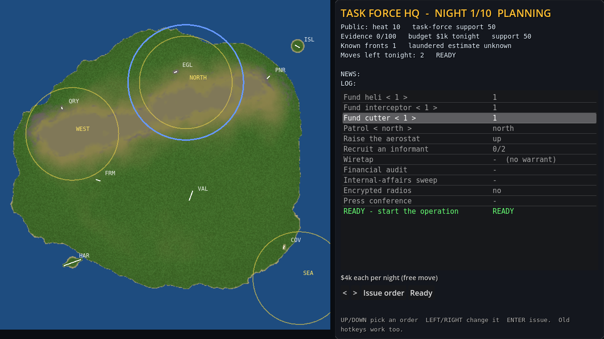 | 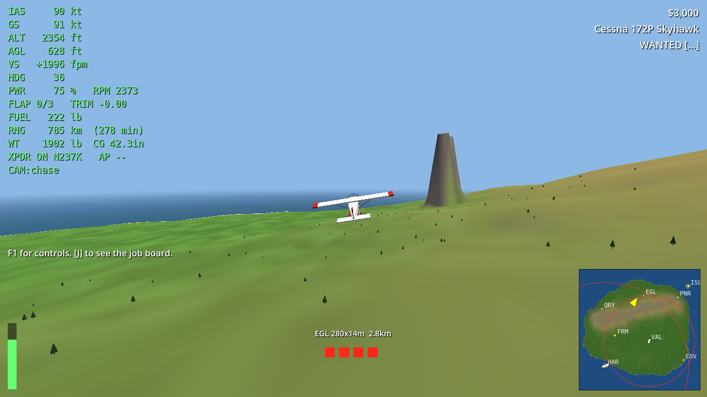 |
| **On foot at the hangars** | **The boss's desk, inside the villa** | **The villa, sited by the generator** |
| 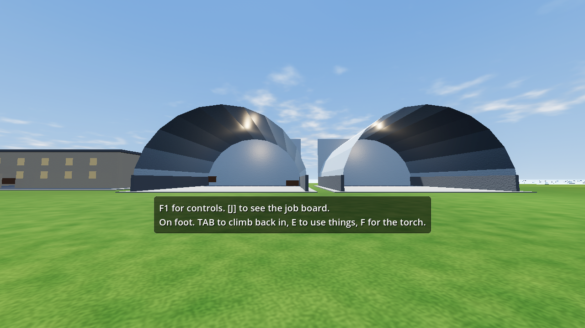 | 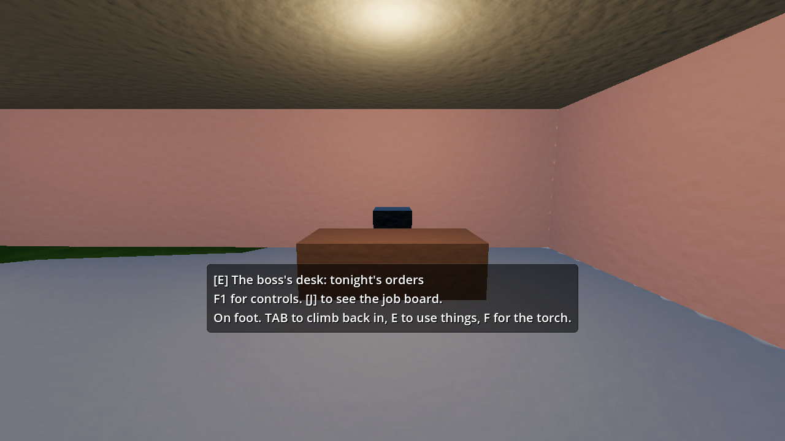 | 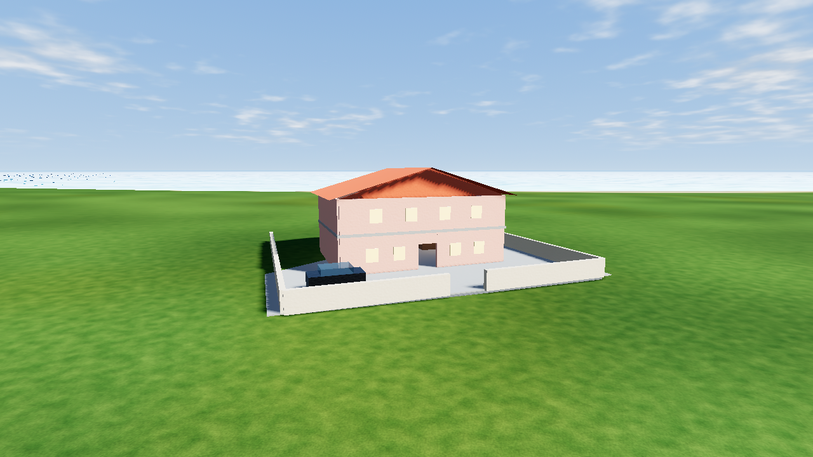 |
| **A storm night** | **Full moon** | **Generated island #7** |
| 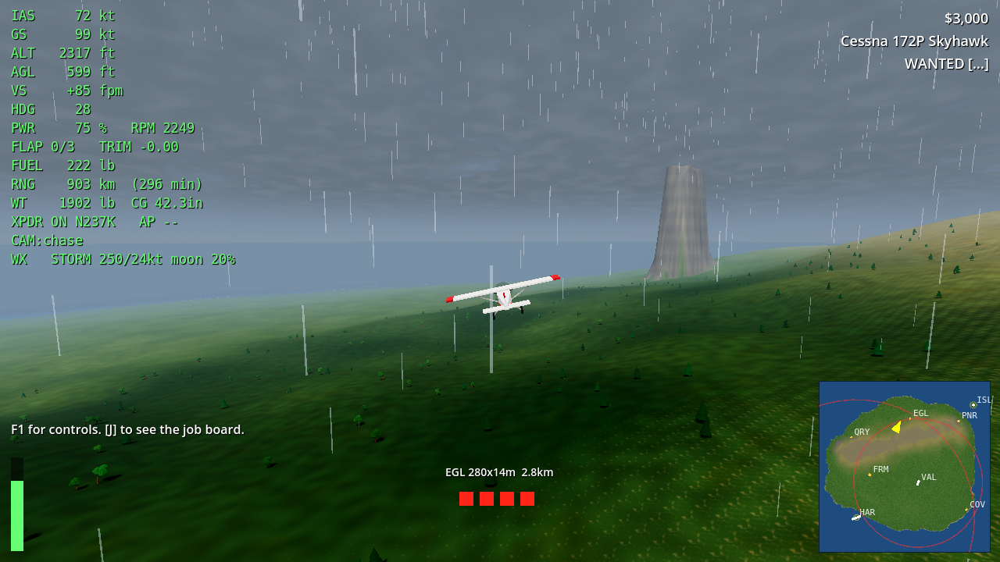 | 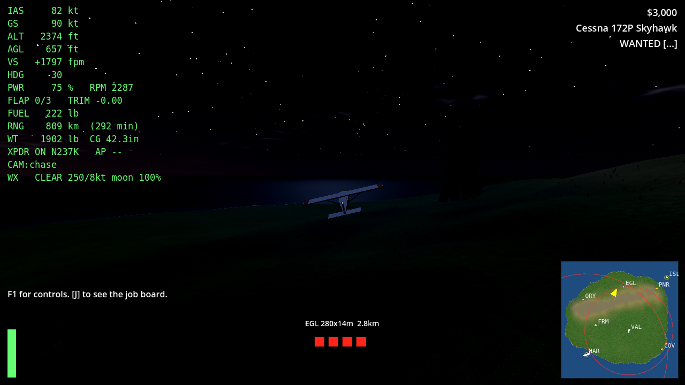 | 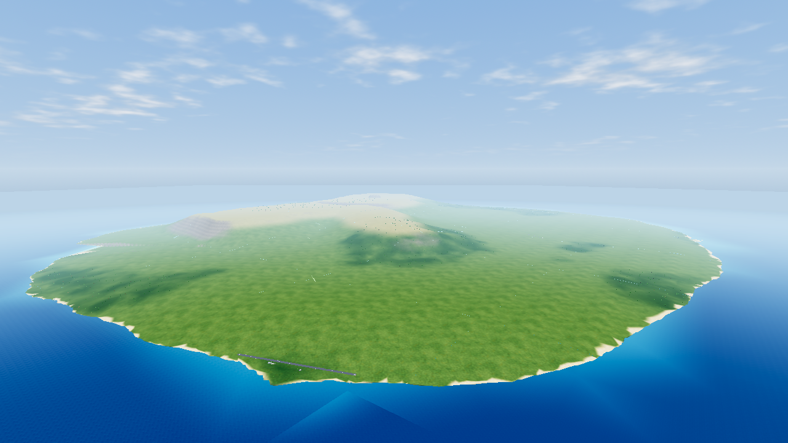 |
| **The HUD, crewed airdrop** | **Co-pilot's desk** | **Lobby** |
| 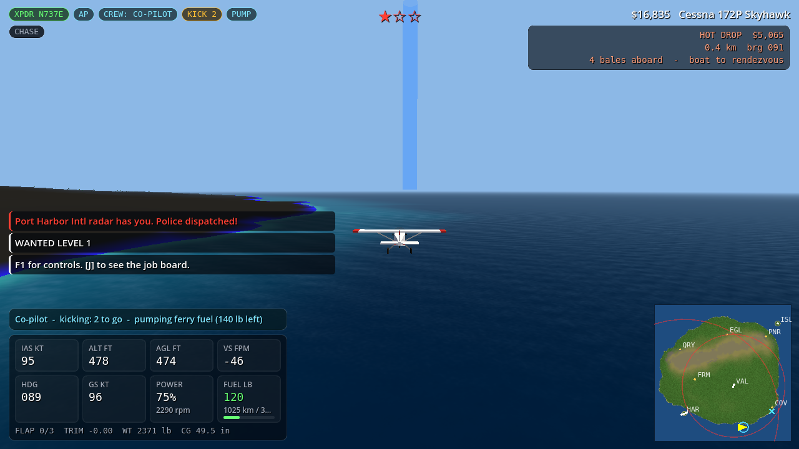 | 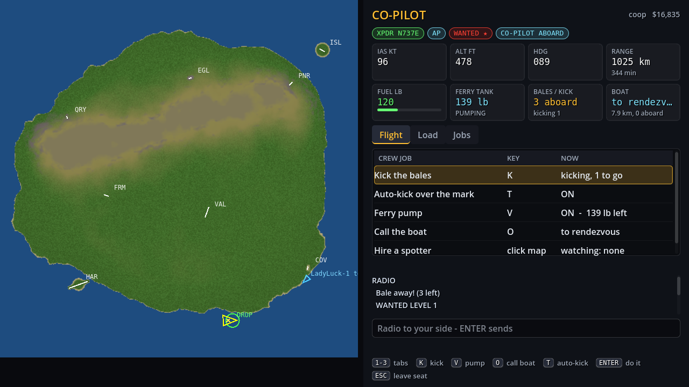 | 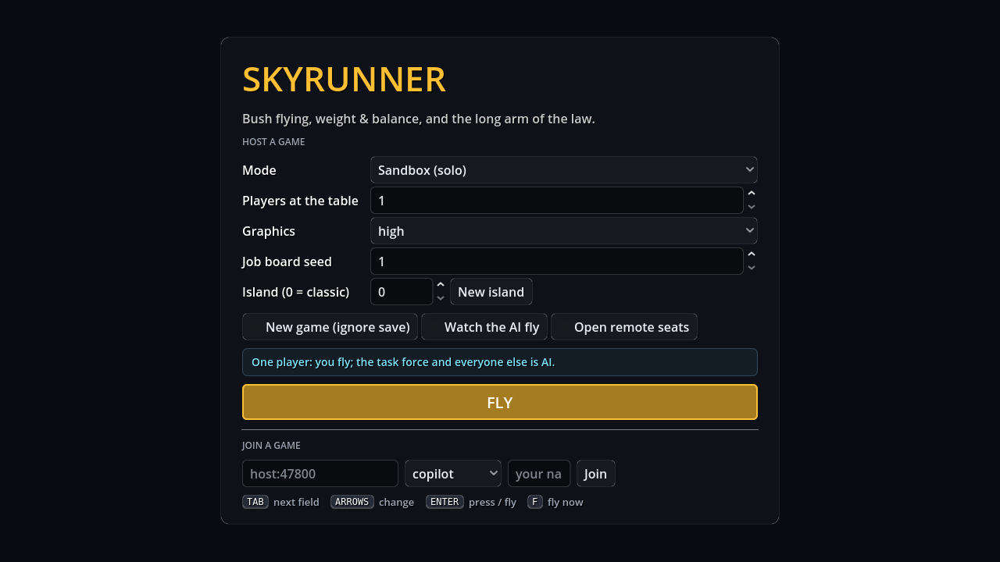 |

*(Rendered on a GPU-less box: Mesa llvmpipe with Godot's compatibility renderer under Xvfb. SSAO and
volumetric fog need Forward+ on a real GPU.)*

## Build and run

```bash
cd games/skyrunner-godot
GODOT=$(./tools/get_godot.sh)        # pinned Godot 4.4.1 into .tools/ (or use your own 4.4 install)
./tools/build_native.sh              # builds bin/libskyrunner_native.so (godot-cpp + JSBSim 1.3.1, ~10 min the first time)
$GODOT --path .                      # lobby: pick a mode, or join a friend's game
$GODOT --path . -- --mode campaign   # or skip the lobby with the same flags as the Python game
./tools/test.sh                      # the test suite, headless (about 2 minutes)
```

Build needs CMake 3.20+, a C++17 compiler and Python 3 (for godot-cpp's binding generator).
`tools/build_native.sh` fetches godot-cpp 4.4 and JSBSim 1.3.1 sources.

Command-line flags (all optional; any flag skips the lobby):

| Flag | Meaning |
|---|---|
| `--mode solo\|campaign\|coop\|versus` | game mode (co-op and versus host remote seats) |
| `--police` | the task-force desk against AI runners, offline |
| `--players N` / `--layer 1-5` | seats and rule layers for a table of N (5+ adds the HQs and seasons) |
| `--graphics low\|medium\|high` | quality preset |
| `--watch` | the pilot bot flies the career; you watch |
| `--host` / `--port 47800` | open remote seats in solo |
| `--connect HOST:PORT --role R [--name N] [--seat3d]` | join as `copilot`, `spotter`, `boat`, `boss`, `controller`, `interceptor` (3D), `cutter` or `chief` |
| `--hour 0-24` | time of day to start at (F2 advances it in game) |
| `--map N` | island: 0 = classic, N = generated island N |
| `--weather clear\|cloud\|storm[,moon]` | tonight's weather outside a season (moon 0 = new .. 1 = full) |
| `--new`, `--seed N` | fresh save; job-board seed |
| `--shot out.png [--frames 90]` | render and save a screenshot, then quit |

Dedicated task-force server (no pilot seat): `$GODOT --headless --path . --script res://scripts/net/dedicated.gd -- --port 47800`.
Python station clients connect to it too, because it speaks the same protocol.

Controls: F1 in game. They are the Python game's keys, plus F2 for time of day, gamepad or joystick
support, and on foot: TAB get out / climb in, WASD walk (Shift runs, Space jumps), mouse look, E use, F torch.

Demo videos: [docs/video/](docs/video/):
- [`demo-ui.mp4`](docs/video/demo-ui.mp4): the redesigned UI in use - lobby, job board, load planner,
  hangar, the HUD on a crewed airdrop, the co-pilot's desk, both HQ boards, the task-force desk
  (`tools/ui_tour.gd`)
- [`demo-tour.mp4`](docs/video/demo-tour.mp4): on foot, the boss's desk, the three HQs (`tools/tour.gd`)
- [`demo-bust.mp4`](docs/video/demo-bust.mp4): a bot flight against the task force, split screen
  (`tools/record_demo.sh`, optionally in weather)

## Balance tooling

```bash
$GODOT --headless --path . --script res://scripts/balance/cli.gd -- all --workers 4   # feasibility, tactical, strategic, report
$GODOT --headless --path . --script res://scripts/balance/cli.gd -- strategic --n 1000
$GODOT --headless --path . --script res://scripts/balance/cli.gd -- crew --seeds 10     # solo vs AI vs human co-pilot
$GODOT --headless --path . --script res://scripts/balance/cli.gd -- tune --n 100 --grid '{"rival_market": [0.3, 0.4]}'
$GODOT --headless --path . --script res://tools/equilibrium.gd -- 500 '{"weather": false}'   # one rule set's equilibrium
```

Results go to `sim-results/*.json` and the report to [docs/BALANCE.md](docs/BALANCE.md).

## Docs

- [docs/PORTING.md](docs/PORTING.md): how the port was checked against the Python game (bit-exact
  RNGs, terrain, flights, seasons), and the traps along the way.
- [docs/BALANCE.md](docs/BALANCE.md): the Godot build's balance report, rival cartel included.
- The design, storyline and multiplayer notes are the Python game's:
  - [../skyrunner/docs/DESIGN.md](../skyrunner/docs/DESIGN.md)
  - [../skyrunner/docs/MULTIPLAYER.md](../skyrunner/docs/MULTIPLAYER.md)

## Licences

JSBSim is LGPL-2.1. Its aircraft and engine data are in `data/jsbsim/`, with the licence in
`data/jsbsim/COPYING.LGPL`. The GDExtension links JSBSim statically into `bin/libskyrunner_native.so`.
LGPL allows that as long as users can relink against a modified JSBSim:
- The complete build (`native/CMakeLists.txt`, `tools/build_native.sh`) is in this repository.
- `SKYRUNNER_JSBSIM_SRC` points the build at any JSBSim checkout.

Godot and godot-cpp are MIT.
