# Skyrunner (Godot 4)

Bush flying, weight and balance, and the long arm of the law, on a fictional Caribbean coast in
1979-86. Godot 4 with **[JSBSim](https://github.com/JSBSim-Team/jsbsim)** flight dynamics through a C++
GDExtension. This is the game: everything runs on Godot. (It started as a Python prototype in
`../skyrunner/`, kept only as the archival reference that generated the frozen parity fixtures in
`tests/fixtures/`; you never need it to build, play or test.) It has:
- five JSBSim aircraft with every item a point mass at its station arm
- tight strips
- the task force and its sensors, airdrops and boats, and the campaign
- co-op and versus seats over the network, and the two HQs' seasons
- the pilot bot and the balance simulators

Beyond the prototype:
- **Load planner.** Pick the station for every item, set the fuel with a slider or presets (25/50/75%,
  full, or "route + 30 min"), and watch the take-off and zero-fuel CG move on the envelope, with
  endurance, range and the route's reserve.
- **HQ order menus for both sides.** The boss and the chief get navigable order lists. Each order shows
  its cost, its effect and its current state. LEFT/RIGHT sets it (which front, who to bribe, how many
  crews, which zone to patrol) and ENTER issues it.
- **A competing smuggling organisation: Los Cuervos.** A third, AI-run cartel flies its own loads every
  night:
  - It fights you for turf: where it owns the market your loads pay less.
  - It splits the task force's attention.
  - It hijacks your load if you meet it on the same route without a truce.
  - The boss can hit it, buy a truce or sell its route to the police.
  - The chief can send a gang unit after it.
  - Its planes fly in the 3D game as AI traffic.
- **On foot, first person.** TAB out of a parked aircraft and walk the apron, the hangars and the three
  headquarters. E uses what you face: the job board, the load planner at the fuel desk, the hangar
  workbench, the boss's desk (the organisation's orders) and the map table (what you know of Los
  Cuervos). F is a torch. The island, every building and the parked aircraft are solid; you climb
  kerbs and terraces but can't swim.
- **Generated islands.** `--map N` (or the lobby's island picker) grows island N: terrain, ten strips
  sited and rated for approach, and the HQs placed where each side would want them - the villa near the
  cove, the task force by the hub, the rival compound up in the hills. `--map 0` is the classic island.
- **The realism layer** (found and tuned by the scenario sweeps; details in
  [docs/BALANCE.md](docs/BALANCE.md) 14-19):
  - *Weather and the moon.* A nightly forecast both HQs see (right 75% of the time). Cloud, rain and a
    dark moon hide you; storms ground helicopters and the aerostat, keep cutters in port, and more than
    double crash risk. In the air: JSBSim wind and Dryden turbulence, rain, lightning, the moon's phase.
    Parked aircraft are tied down.
  - *Pattern of life.* The task force's analysts learn your routine: repeat a route and they expect you
    (up to +45% detection). Mixing your routes is the inspection game's answer.
  - *Canary trap.* The chief can feed a bribed dispatcher a fake patrol. Swerve around it and your man is
    arrested, so a leak is never ground truth.
  - *Rival tempers.* Los Cuervos are tit-for-tat, grudge-holders or opportunists, and you learn which
    from how they behave. Truces unravel as the season runs out (backward induction).
  - *Spare helicopters patrol.* The task force keeps one helicopter for the chase and flies every
    spare over a zone before the run - where the analysts expect you. Flag one and it joins the
    chase as a flanker, aiming ahead to cut you off; two aircraft on your tail box you in (the bust
    meter fills 50% faster). The sims showed why: one chaser already catches every runner it can
    reach, so extra aircraft pay by finding you, not by chasing harder.
  - *Nerves.* Stress follows what real smuggling pilots feared. Past the Yerkes-Dodson hump the screen
    tunnels, you hear your heartbeat and your hands shake (8-12 Hz, human hands only). A co-pilot
    steadies you.
- **Radar and radio that behave like the real thing:**
  - *Radar.* 4/3-earth horizon, sea clutter that rises with the wind, rain clutter, and an MTI notch:
    cross the beam or fly slow and a primary radar cancels you as clutter. Every site turns at its own
    rate (ASR 4.8 s, the aerostat 12 s); detection falls off with range and the aircraft's size. Tracks
    keep a trail and, with a transponder on, Mode C altitude. Squawk codes are real: 1200 VFR, and 7700,
    7600 and 7500 get a response from Center (key 7). The desk shades each site's blind valleys (G).
  - *Radio.* VHF line of sight over the terrain; police dispatch and tactical channels, the runner crew
    and the boat. The length of a call sets how well it DFs (SHIFT+O sends a one-second codeword), and a
    least-squares fix draws its error ellipse on the desk's map. Crew chat is radio too.
- **Upgrade trees for both sides** (hangar LEFT/RIGHT for the runner; U at the task-force desk):
  | Runner | |
  |---|---|
  | Electronics & counter-surveillance | scanner -> programmable scanner -> burst transmitter; radar detector -> direction-finding detector -> transponder spoofer |
  | Espionage | lookouts; bug sweeps -> mole in dispatch -> double agent |
  | Airframe | ferry tank; low-visibility paint -> quiet propeller; heavy-duty gear |
  | Weaponry | armed boat crew -> armed strip guards |

  | Task force | |
  |---|---|
  | Sensors | Doppler processing -> airborne early warning; coastal radar |
  | Signals | encrypted radios; helicopter DF -> intercept runner channels -> jammer van (J) |
  | Intelligence | informant network -> undercover agent; mole hunt |
  | Interdiction | armed helicopter -> Blackhawk; fast patrol boat |

  The runner pays from their money. The task force pays from its funds: a budget of $40 a minute plus
  asset forfeiture ($3,000 a bust, $1,500 + $100 a bale for a seized boat, more when the crew was
  armed). With no human at the desk the AI chief buys the cheapest thing it can afford as the money
  comes in. Weaponry is abstract: it changes chases, boardings and raids, never shows a wound, and it
  raises the stakes.
- **Costa Brava, the city coast (the default map).** The port city of San Telmo (a street grid of
  ~6,900 buildings with windows lit at night, the docks with cranes and a harbour basin), the
  international airport on the coastal plain, a meandering river to a mangrove estuary, a farm plain
  of patchwork fields, a jungle range with a mesa strip, scrub hills and the old quarry, the cove and
  the cays. Land use drives the terrain shader, the vegetation (mangroves, jungle, thorn scrub) and
  the physics: buildings are obstacles, kept out of every glide path. The HQs are Club Tropicana
  downtown (the boss's office upstairs), the customs house on the docks with a radar tower, and Los
  Cuervos' hacienda in the foothills. `--map city`, `--map 0` (classic), `--map N` (generated), or
  the lobby's map picker; old saves keep their island.
- **Stash houses.** Eight of them (a farm barn, a mangrove shack, Warehouse 7 on the docks, a lock-up
  in Barrio Chino, a jungle camp, a quarry shed, a boathouse on the cays, a hillside villa). A stash
  run lands at a nearby strip; the crew trucks the load in while you fly on. Police overhead or a
  roadblock can stop the truck (likelier as the stash heats up with use, at a police strip, or when
  you're tipped). The task force can raid a stash it knows about (X at the desk; the AI raids busy
  ones), burning it for good.
- **Markets.** Every good has a price in each market (the town and the three zones) that moves with
  rival turf and rival flights (they undercut you on drugs and buy guns), police presence (a risk
  premium where they're thick), seizures (scarcity island-wide), your own deliveries (a glut where you
  sell), fuel (a price of its own that passes through to fares, freight and fuel drums), storms and
  the news. Contraband is paid at the street price on delivery; legal work as agreed. J, then
  LEFT/RIGHT, shows the market.
- **Gun running and arsenals.** The organisation, the task force and Los Cuervos each hold weapons
  (pistols, rifles, machine guns, RPGs) and ammunition. Gun runs bring crates in: on delivery sell
  them at the street price or keep them for your soldiers (G on the job board). The fence buys, a
  dealer sells. Whatever the police seize - a busted load, a stopped truck, a raided stash, the
  guns off men arrested in a firefight - goes into the police arsenal and arms their patrols.
- **The ground war.** Soldiers, Los Cuervos' crews and narcotics squads on foot, in cars and trucks,
  driving the city's roads. Firefights are Lanchester's square law on weapons, cover and nerve.
  The organisation and Los Cuervos fight as guerrillas (ambushes at chokepoints, hit and run,
  melting into the barrio, the jungle and the mangroves, decoy cars, harassment); the task force
  fights like a narcotics unit (stakeouts, tailing a truck home, informants' controlled buys,
  buy-busts, a cordon before the raid, checkpoints, saturation patrols, SWAT, and restraint: it
  doesn't fire first and it prefers arrests). Trucks run the roads past checkpoints, with escorts.
  Who's on the streets moves the markets and, night by night, Los Cuervos' turf. The AI commands
  every side until a human takes the **lieutenant** or **patrol commander** seat; the boss, chief
  and controller can take over too (Q at their desk).
- **On foot with a gun.** Out of the aircraft, 1-4 draw a pistol, rifle, machine gun or RPG from the
  armoury; the left button fires (walls stop rounds). Squads who have it in for you shoot back.
  Go down near the police and you're arrested; elsewhere it's a doctor's bill and the gun.
- **Every seat is the AI's until someone takes it.** Join a game mid-way, see the live seat list,
  and take any role the AI is playing: pilot, co-pilot, spotter, boat, boss, lieutenant,
  controller, police pilot, cutter, chief or patrol. Leave, and the AI takes it back; drop, and
  the seat waits 30 s for your reconnect token. Table talk to everyone or your side. F3 hands the
  aircraft to the AI so the host can sit at another desk. ([docs/MULTIPLAYER.md](docs/MULTIPLAYER.md) section 7)
- **The news.** Breaks and bad luck for all three outfits, some random and some milestones (the
  first delivery, a burned stash, officers down, flash money that gets noticed), each changing
  something real, run as headlines by the island's papers and radio. A timeline of real
  1979-86 headlines runs too, from the Mariel boatlift to Iran-Contra.
- **The Agency.** A covert arms pipeline to the Contras runs through the island's strips. Fly for
  it and it protects you: busts quashed from Washington, checkpoints told to wave your trucks
  through. Every quash leaves a trail; the task force can dig (V at the desk), and when it's
  exposed the hearings end it. Fiction, inspired by the documented Iran-Contra record
  ([docs/DESIGN.md](docs/DESIGN.md) section 13).
- **One UI, redesigned.** A single theme across every screen; real tables with titled columns (the job
  board colours the landing roll against the strip length); key caps in every footer that you can
  also click; readouts as tiles; a HUD laid out by what you need when (status chips, wanted stars,
  flight tiles, job cards, fading radio toasts, and a crew strip saying what the co-pilot is doing).
  The co-pilot's desk opens on a Flight tab of crew jobs with live tiles, has a chat line to the pilot,
  and hires a spotter wherever you click a strip. ESC asks before leaving a seat. The UI scales with
  the window (tested 1024x768 to 2560x1080).
- **Graphics overhaul:**
  - chunked, LOD'd terrain with a biome splat shader (sand, grass, forest floor, dry grass, rock
    triplanar on steep faces, normal-mapped); a depth-aware sea with shoreline foam; a procedural sky
    with clouds, sun, stars and the moon; palm, broadleaf, conifer and bush MultiMeshes swaying in the
    wind; hangars, terminals, fuel desks and the three HQs as real walkable buildings with lit windows
    and lamps
  - a day/night cycle driving sun, sky and fog
  - runway edge and threshold lights, aircraft nav lights, strobes and landing lights, and police
    light bars and a searchlight at night
  - shaded terrain (rock on steep faces, detail noise, a wet shoreline) and animated water
  - MultiMesh forests, directional shadows, glow, and SSAO and volumetric fog on Forward+
  - dust on unpaved take-off rolls, boat wakes and prop discs

- **The 1980s-coast look.** Pastel art-deco blocks (flamingo, mint, lilac, peach) with white,
  turquoise or pink trim along the roofline, "speed line" bands, and neon strips that glow pink and
  cyan after dark; palm-lined boulevards; a sky that goes orange, magenta and violet at sunset and
  violet at night, with the city's glow on the haze; a saturated colour grade. The UI is hot pink
  and electric cyan on deep violet with brush-script neon headlines (Kaushan Script and Monoton,
  both under the SIL Open Font Licence, in `assets/fonts/`), and a big banner when a run pays off
  or you're busted. Original art throughout: the genre's look, nobody's assets.

- **Low-poly models (Kenney, CC0).** The people, cars, guns, boats and street palms are from Kenney's
  public-domain kits (Blocky Characters, Car Kit, Weapon Pack, Watercraft Kit, Nature Kit), in
  `assets/models/kenney/` and loaded through `ModelLib`, which scales them to metres and turns them
  to face forward. The nearest men in the ground war are animated characters: the faction's looks
  (suits and vests for the organisation, bandoliers for Los Cuervos, uniforms, plain clothes and SWAT
  black for the task force), the gun from their squad's loadout at the chest, and the kit's walk,
  run, aim, fire and fall. Further out they're cheap MultiMesh figures. The first-person gun is the
  Weapon Pack's; the go-fast is a speedboat, and the cutter a white hull with an orange-red stripe.
  The aircraft stay procedural, built to the JSBSim models' dimensions. Without the model files
  everything falls back to procedural boxes.

| **Dusk on the boulevard** | **Sunset over San Telmo** | **The city at night** |
|---|---|---|
| 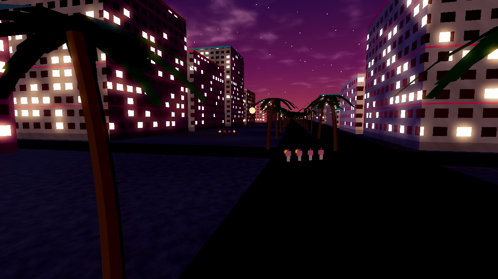 | 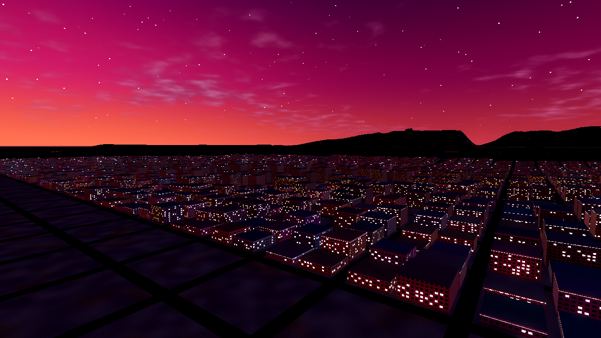 | 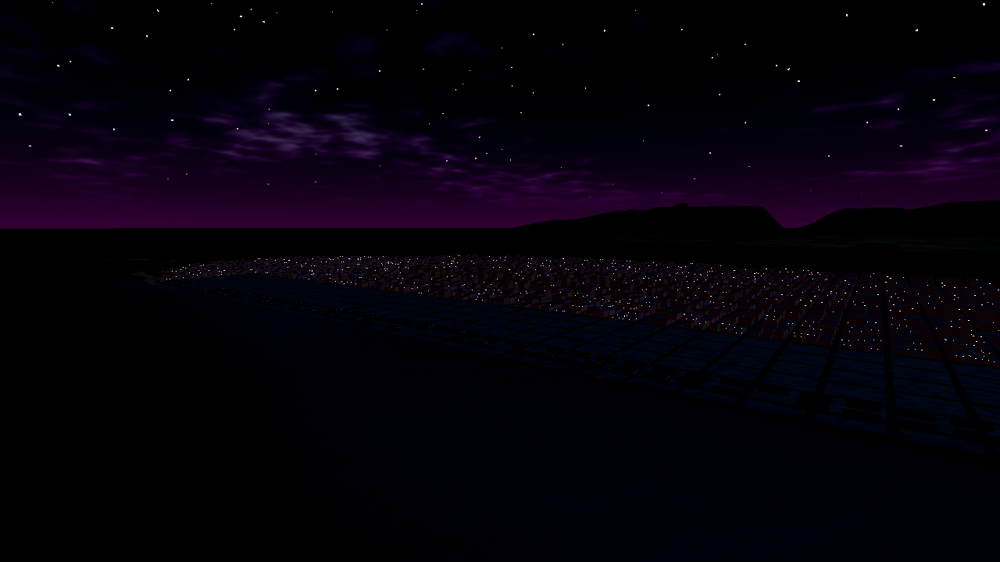 |
| **The lieutenant's desk** | **Take a seat: the AI plays the rest** | **A firefight at the docks** |
| 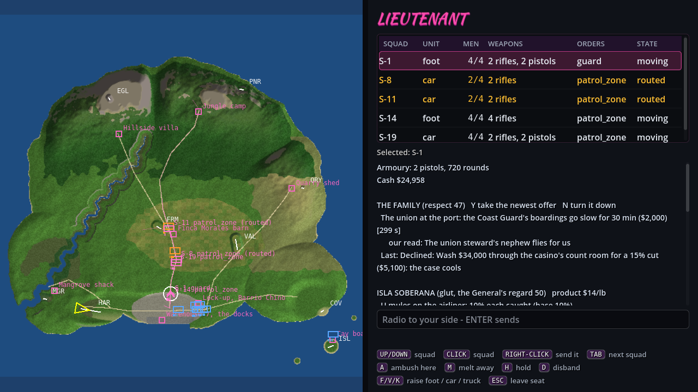 | 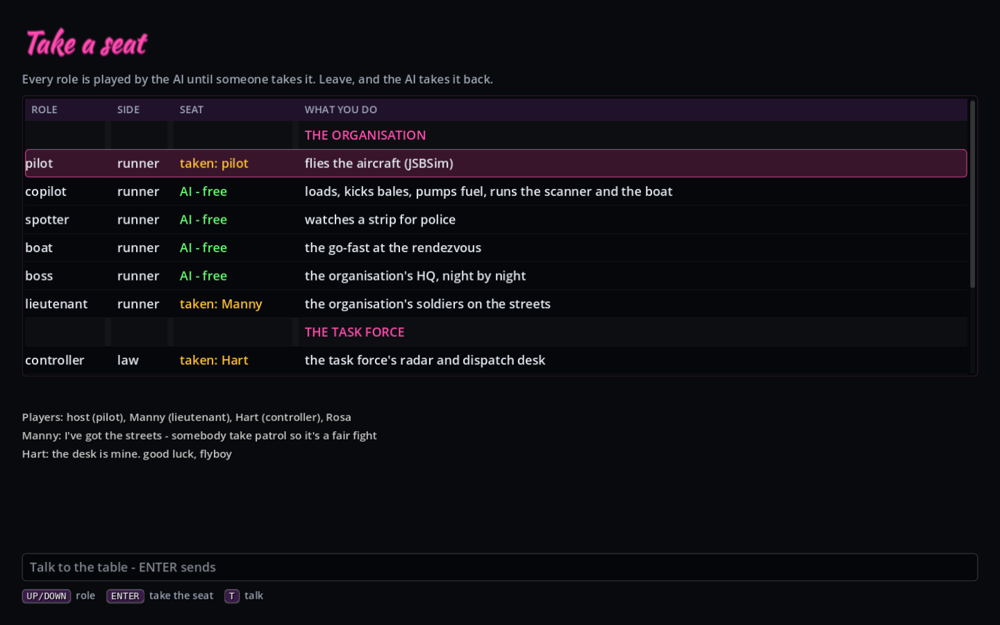 | 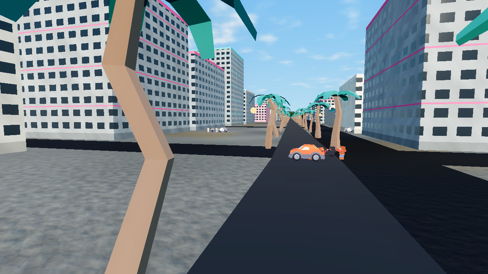 |
| **The cast and the cars (Kenney CC0)** | **On foot with a rifle** | |
| 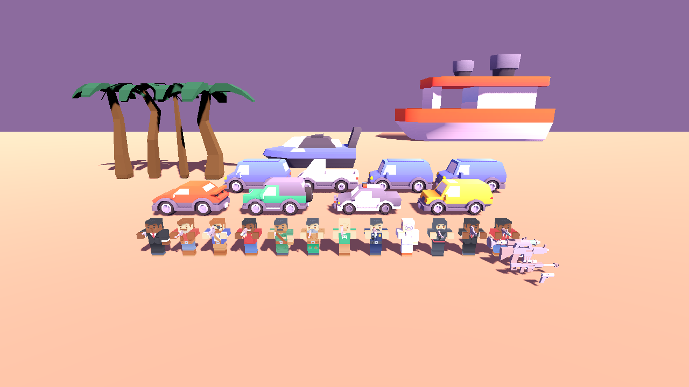 | 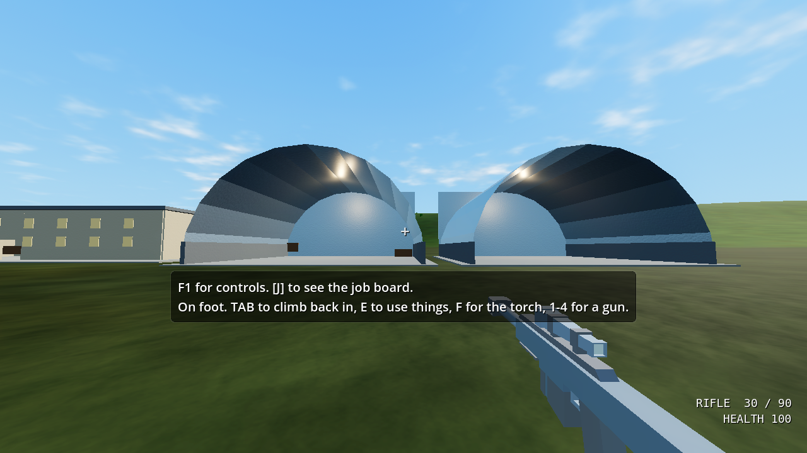 | |

| Mid-afternoon on the runway (medium) | Dusk, climbing out near Eagle's Nest (high) | Night: edge lights on |
|---|---|---|
|  |  |  |
| **Load planner** | **Boss: the organisation's orders** | **Task-force desk** |
|  |  |  |
| **Job board** | **Chief: the task force's orders** | **Low preset** |
|  |  |  |
| **On foot at the hangars** | **The boss's desk, inside the villa** | **The villa, sited by the generator** |
|  |  |  |
| **A storm night** | **Full moon** | **Generated island #7** |
|  |  |  |
| **The HUD, crewed airdrop** | **Co-pilot's desk** | **Lobby** |
|  |  |  |
| **Runner upgrades (hangar)** | **Task-force upgrades (desk, U)** | **The market** |
| 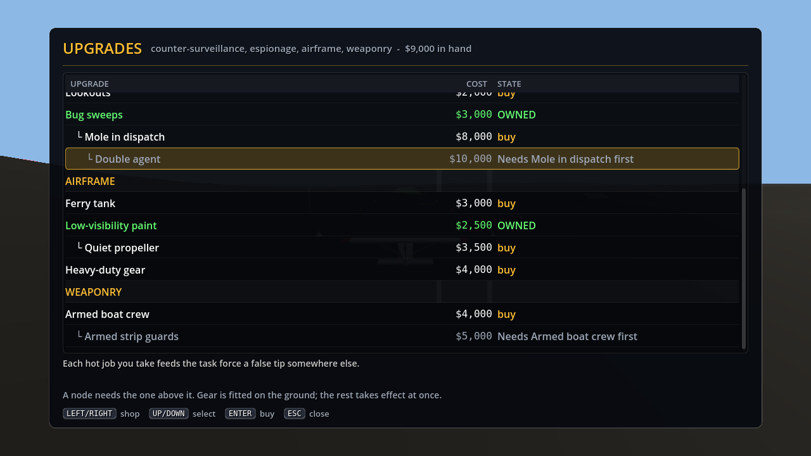 | 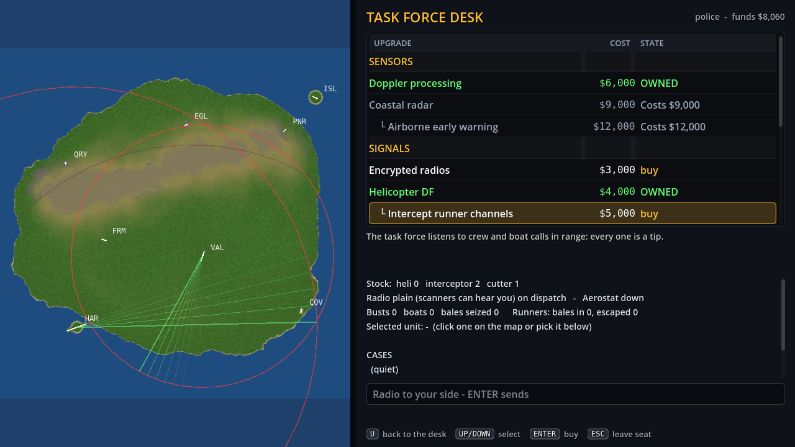 | 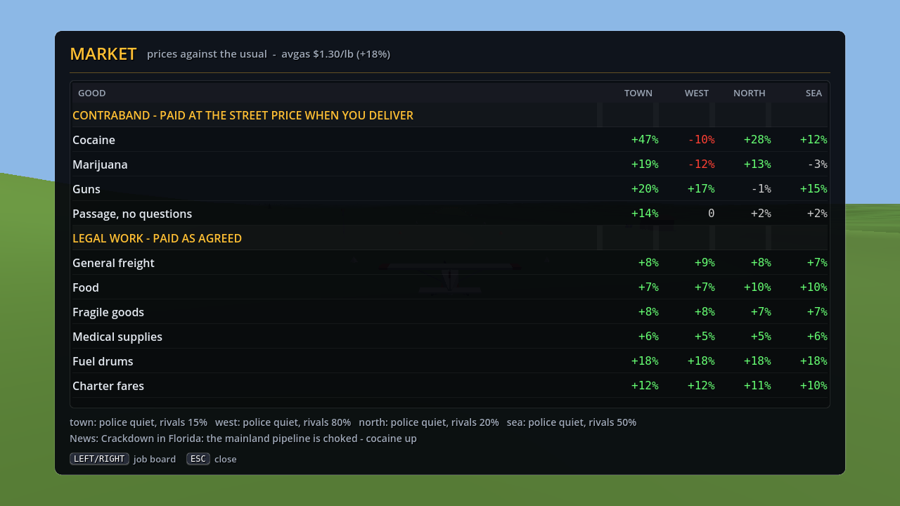 |
| **San Telmo, downtown** | **The port at night** | **Costa Brava, the map** |
| 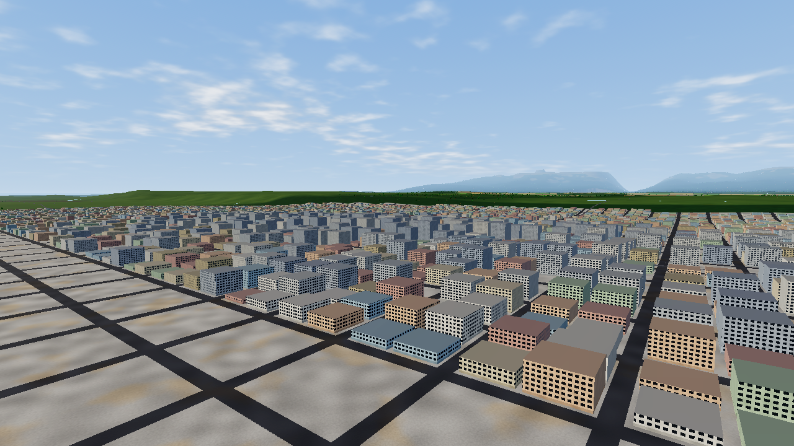 | 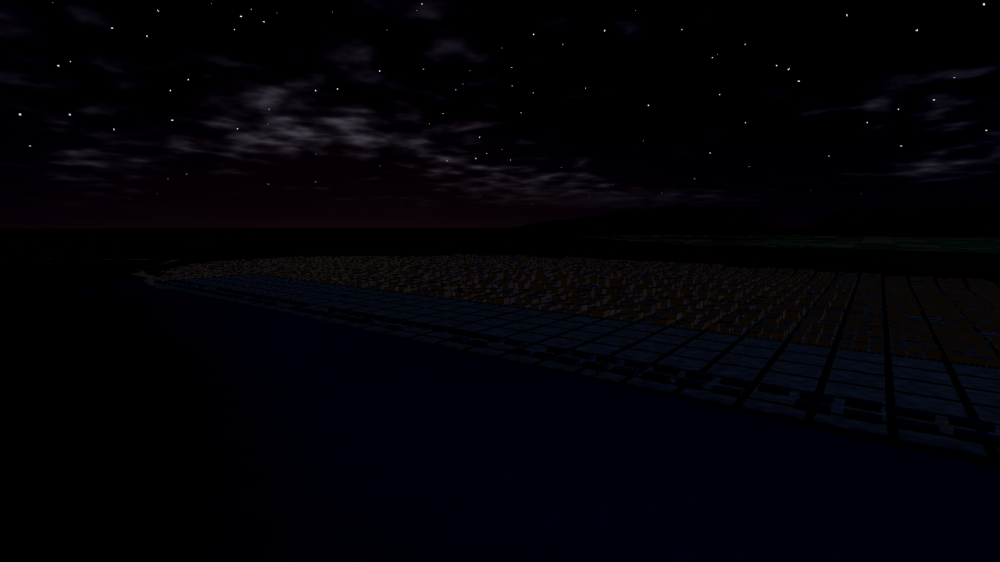 | 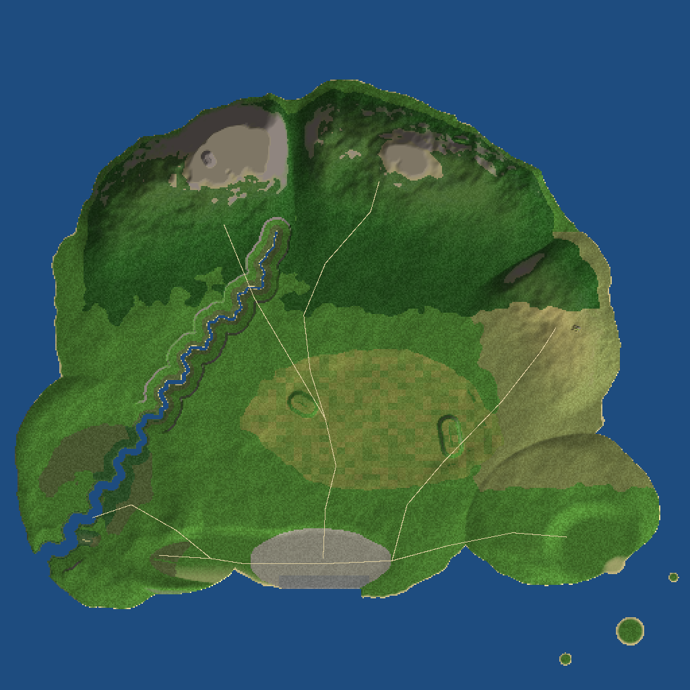 |

*(Rendered on a GPU-less box: Mesa llvmpipe with Godot's compatibility renderer under Xvfb. SSAO and
volumetric fog need Forward+ on a real GPU.)*

## Build and run

```bash
cd games/skyrunner-godot
GODOT=$(./tools/get_godot.sh)        # pinned Godot 4.4.1 into .tools/ (or use your own 4.4 install)
./tools/build_native.sh              # builds bin/libskyrunner_native.so (godot-cpp + JSBSim 1.3.1, ~10 min the first time)
$GODOT --path .                      # lobby: pick a mode, or join a friend's game
$GODOT --path . -- --mode campaign   # or skip the lobby with flags (below)
./tools/test.sh                      # the test suite, headless (about 2 minutes)
```

Build needs CMake 3.20+, a C++17 compiler and Python 3 (only as godot-cpp's binding generator at build time).
`tools/build_native.sh` fetches godot-cpp 4.4 and JSBSim 1.3.1 sources.

Command-line flags (all optional; any flag skips the lobby):

| Flag | Meaning |
|---|---|
| `--mode solo\|campaign\|coop\|versus` | game mode (co-op and versus host remote seats) |
| `--police` | the task-force desk against AI runners, offline |
| `--players N` / `--layer 1-5` | seats and rule layers for a table of N (5+ adds the HQs and seasons) |
| `--graphics low\|medium\|high` | quality preset |
| `--watch` | the pilot bot flies the career; you watch |
| `--host` / `--port 47800` | open remote seats in solo |
| `--connect HOST:PORT [--role R] [--name N] [--seat3d]` | join; `--role pick` (or none from the lobby) opens the live seat list; or sit straight down as `pilot` (3D), `copilot`, `spotter`, `boat`, `boss`, `lieutenant`, `controller`, `interceptor` (3D), `cutter`, `chief` or `patrol` |
| `--hour 0-24` | time of day to start at (F2 advances it in game) |
| `--map city\|N` | map: `city` = Costa Brava (the default for new games), 0 = the classic island, N = generated island N |
| `--weather clear\|cloud\|storm[,moon]` | tonight's weather outside a season (moon 0 = new .. 1 = full) |
| `--new`, `--seed N` | fresh save; job-board seed |
| `--shot out.png [--frames 90]` | render and save a screenshot, then quit |

Dedicated server: `$GODOT --headless --path . --script res://scripts/net/dedicated.gd -- --port 47800`.
Every seat is run by the AI until a player claims it.

Controls: F1 in game lists them; F2 for time of day, gamepad or joystick
support, and on foot: TAB get out / climb in, WASD walk (Shift runs, Space jumps), mouse look, E use, F torch.

Demo videos: [docs/video/](docs/video/):
- [`demo-ui.mp4`](docs/video/demo-ui.mp4): the redesigned UI in use - lobby, job board, load planner,
  hangar, the HUD on a crewed airdrop, the co-pilot's desk, both HQ boards, the task-force desk
  (`tools/ui_tour.gd`)
- [`demo-tour.mp4`](docs/video/demo-tour.mp4): on foot, the boss's desk, the three HQs (`tools/tour.gd`)
- [`demo-city.mp4`](docs/video/demo-city.mp4): Costa Brava - fly-overs of the city, estuary and farm
  plain, a crewed airdrop with the radar detector, the task-force desk (radar sweeps, coverage, DF
  bearings and ellipse, the jammer), a stash run's truck, the market and the upgrade trees, the port
  at night (`tools/city_tour.gd`)
- [`demo-ground.mp4`](docs/video/demo-ground.mp4): the ground war, the seats and the 1980s-coast look -
  sunset over San Telmo, a firefight on a palm-lined boulevard, the lieutenant's and patrol
  commander's desks, the seat picker, on foot with a rifle, a run paying off, the city's neon at
  night (`tools/ground_tour.gd`)
- [`demo-bust.mp4`](docs/video/demo-bust.mp4): a bot flight against the task force, split screen
  (`tools/record_demo.sh`, optionally in weather)

## Balance tooling

```bash
$GODOT --headless --path . --script res://scripts/balance/cli.gd -- all --workers 4   # feasibility, tactical, strategic, report
$GODOT --headless --path . --script res://scripts/balance/cli.gd -- strategic --n 1000
$GODOT --headless --path . --script res://scripts/balance/cli.gd -- crew --seeds 10     # solo vs AI vs human co-pilot
$GODOT --headless --path . --script res://scripts/balance/cli.gd -- tune --n 100 --grid '{"rival_market": [0.3, 0.4]}'
$GODOT --headless --path . --script res://tools/equilibrium.gd -- 500 '{"weather": false}'   # one rule set's equilibrium
```

Results go to `sim-results/*.json` and the report to [docs/BALANCE.md](docs/BALANCE.md).

## Docs

- [docs/DESIGN.md](docs/DESIGN.md): roles, gadgets and counters, systems, the storyline, the ground war
  and the seat model.
- [docs/MULTIPLAYER.md](docs/MULTIPLAYER.md): design research for asymmetric versus play, layers,
  hidden information, the network protocol.
- [docs/PORTING.md](docs/PORTING.md): how the Godot build was checked bit-exact against the Python
  prototype (RNGs, terrain, flights, seasons); that prototype is archival now.
- [docs/BALANCE.md](docs/BALANCE.md): the Godot build's balance report, rival cartel included.

## Licences

JSBSim is LGPL-2.1. Its aircraft and engine data are in `data/jsbsim/`, with the licence in
`data/jsbsim/COPYING.LGPL`. The GDExtension links JSBSim statically into `bin/libskyrunner_native.so`.
LGPL allows that as long as users can relink against a modified JSBSim:
- The complete build (`native/CMakeLists.txt`, `tools/build_native.sh`) is in this repository.
- `SKYRUNNER_JSBSIM_SRC` points the build at any JSBSim checkout.

Godot and godot-cpp are MIT.

The 3D models in `assets/models/kenney/` are Kenney's (www.kenney.nl), CC0 1.0 (public domain);
see `assets/models/kenney/LICENSE.txt`.
