# Skyrunner

A bush-flying and smuggling game built on **[JSBSim](https://github.com/JSBSim-Team/jsbsim)**, the
open-source flight dynamics engine used by FlightGear and many research simulators, with a
**[Panda3D](https://www.panda3d.org/)** front-end. It's set on a fictional Caribbean island between
1979 and 1986. The era's South Florida smuggling boom and the task forces sent after it inspired the
setting (full plan and storyline: [docs/DESIGN.md](docs/DESIGN.md)).

- **Fly real JSBSim aircraft**: Cessna 172P, Cessna 182, Piper PA-28, Cessna 310 and DHC-6 Twin Otter.
- **The aircraft is the puzzle**: every passenger, crate, bale and gallon of fuel is a JSBSim point
  mass at its real station arm. Overload it and the takeoff roll grows; put the load aft and it pitches
  up and stalls. Fuel is weight, so ferry bladder tanks trade cargo for range.
- **Tight strips**: a 240 m quarry trench, a 280 m cliff-top mesa, a one-way hillside strip, a beach.
- **Both sides of the law**: run loads past radar, scanners, informants and interceptors. Or sit at the
  task-force desk and hunt the runners.
- **Crew play**: a friend can join as co-pilot to load, kick bales out of the door to a go-fast boat,
  pump ferry fuel and work the radio scanner. Another can be your ground spotter. A rival player can
  run the police desk against you, or climb into a police interceptor or helicopter and fly it in 3D.
- **Two headquarters**: with five or more players, a boss runs the smuggling organisation (laundering
  fronts, bribes, contract crews, decoys, lawyers) and a chief runs the task force (budget,
  informants, wiretaps, audits) over a season of nights. The rules scale with the number of players.
- **Balanced by simulation**: a pilot bot flies the real JSBSim aircraft against the AI police in
  hundreds of runs, HQ bots play thousands of seasons, and the rules were changed where the numbers
  said so ([docs/BALANCE.md](docs/BALANCE.md)).

| Approach to Eagle's Nest (280 m mesa strip) | Job board | Police on your tail |
|---|---|---|
| 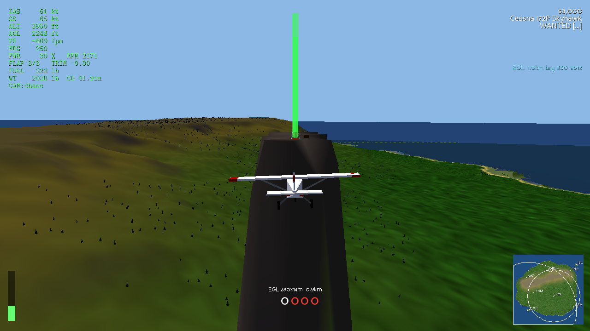 | 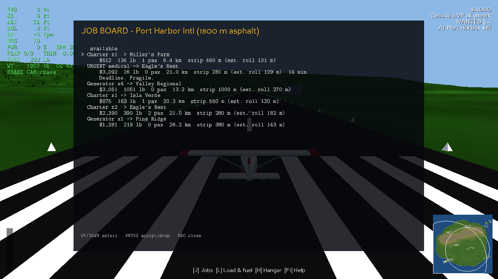 | 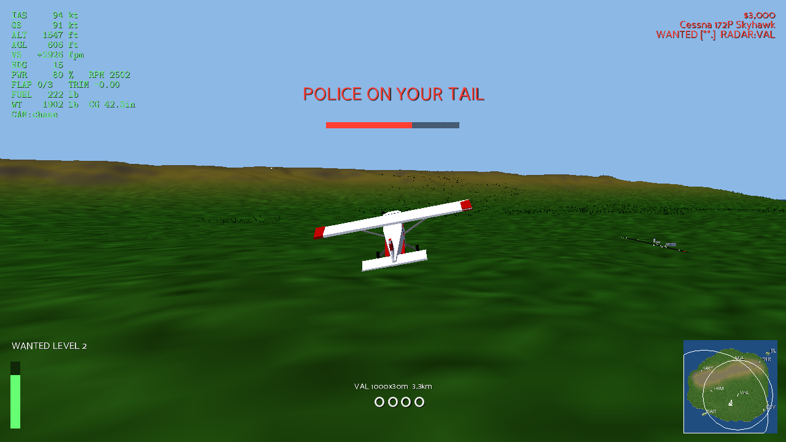 |
| **Campaign briefing** | **Go-fast boat at the rendezvous** | |
| 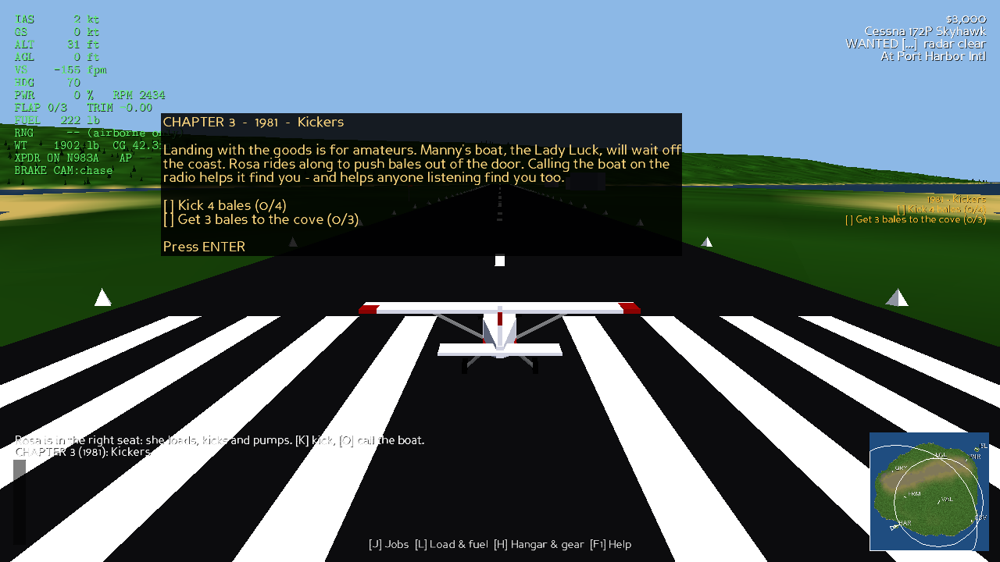 | 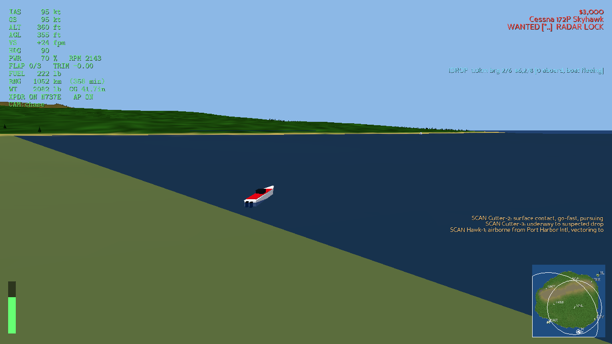 | |
| **Co-pilot station** (load plan, boat, drop marker, spotter ring) | **Task-force desk** (radar rings, units, radio) | **Police pilot seat** (3D, remote) |
| 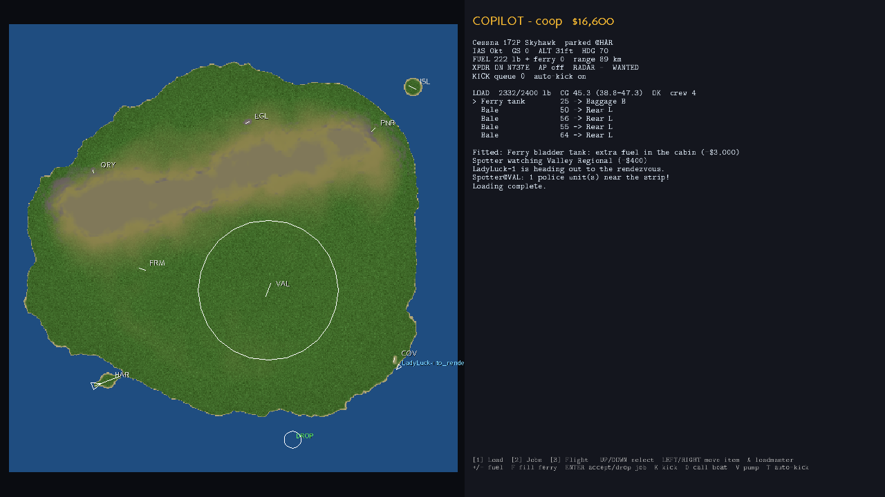 | 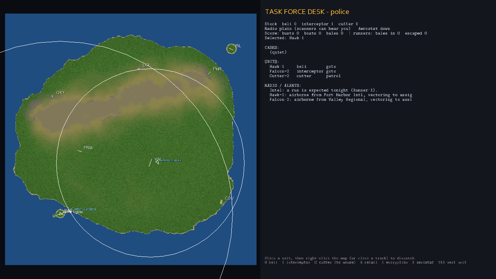 | 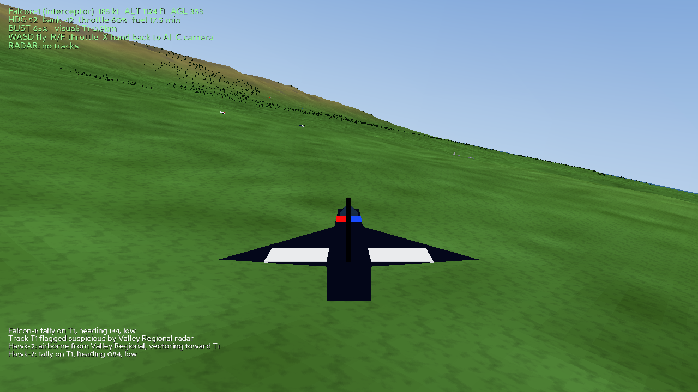 |
| **Organisation HQ** (boss) | **Task-force HQ** (chief) | **Graphics: low vs medium** |
| 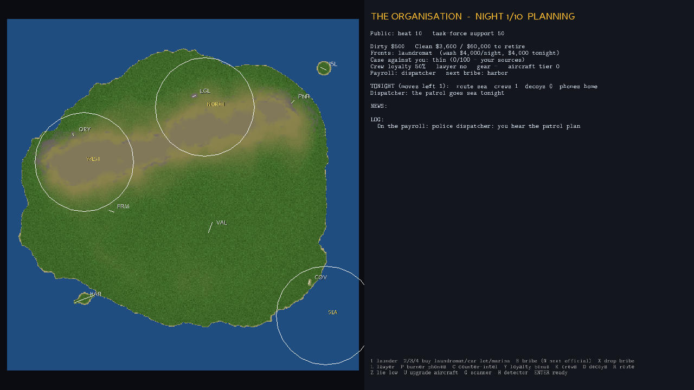 | 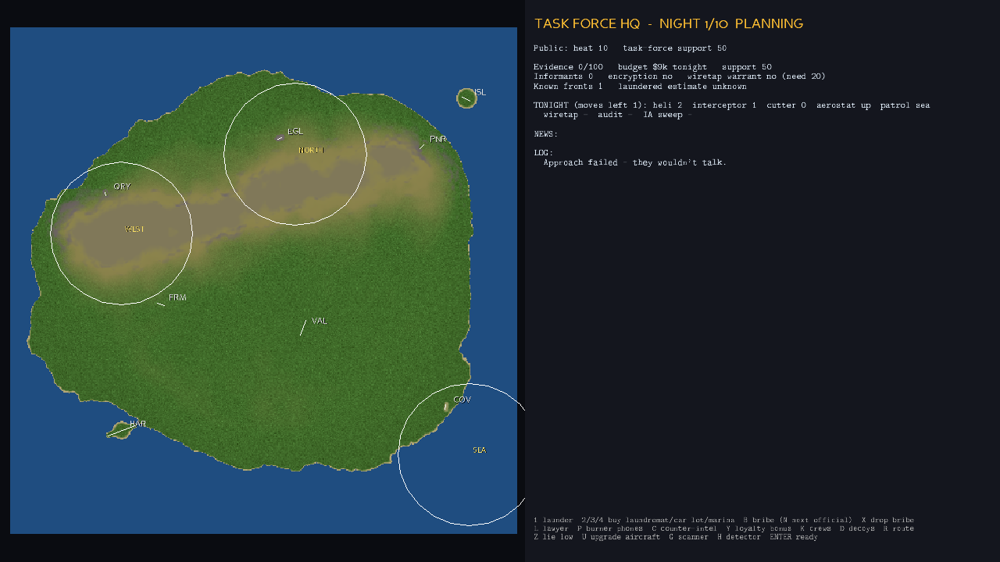 | 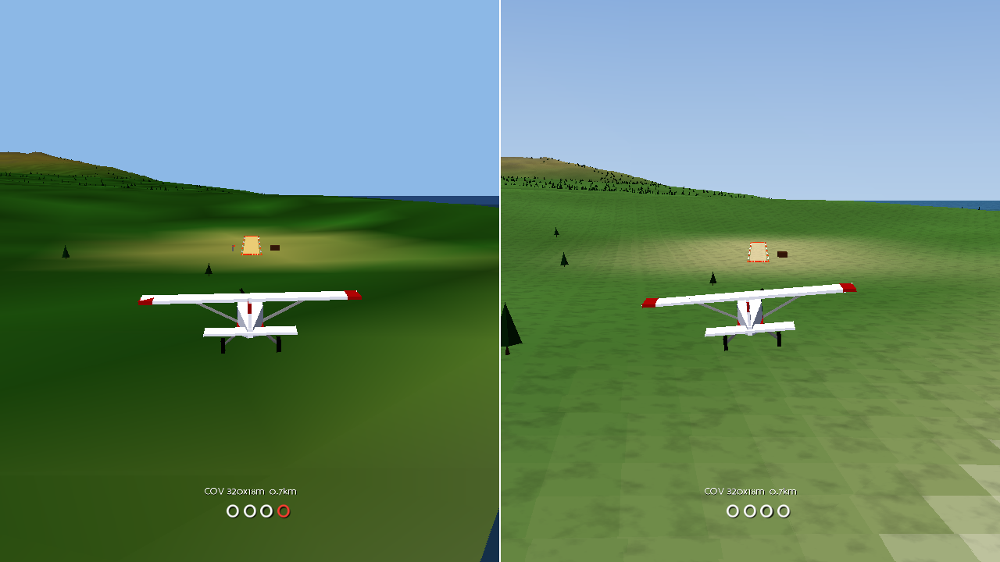 |

*(Screenshots from Panda3D's software renderer in a headless CI box, which ignores line colours and
lighting. With a GPU you get both, plus multisampling.)*

## Quick start

```bash
cd games/skyrunner
python3 -m venv .venv && . .venv/bin/activate
pip install -r requirements.txt

python -m skyrunner                    # sandbox, solo (add --new to wipe the save)
python -m skyrunner --mode campaign    # story mode, 1979 ->
python -m skyrunner --police           # play the task force against AI runners
python -m skyrunner --players 6        # seats and rule layers for a table of six (prints the plan)
python -m skyrunner --watch --graphics low   # the AI pilot plays the career; you watch
python -m skyrunner.sim strategic      # simulate thousands of HQ seasons (~10 s)
python -m pytest -q tests              # 108 headless tests, ~35 s
```

Graphics: `--graphics high` (default: textures, per-pixel lighting, sun shadows, 4x MSAA), `medium`
(textures, fixed-function lighting) or `low` (vertex colours, half-resolution terrain, a third of the
trees, no shaders). Use low for watching bots or on old hardware. The simulators and tests don't load
Panda3D at all.

Requirements: Python 3.10+ and any GPU with OpenGL 2.1 or newer. On first launch the game builds a
patched copy of the JSBSim aircraft data in your temp directory (see *How JSBSim is used*).

## Modes and multiplayer

| Mode | How | Who plays what |
|---|---|---|
| Solo sandbox | `python -m skyrunner` | You fly; AI task force; optional AI co-pilot (hire in `H`) |
| Campaign | `python -m skyrunner --mode campaign` | Chapters 1–4 (1979–1982), one new system per chapter |
| Task force vs AI | `python -m skyrunner --police` | You run the desk; AI runners come in low from the south |
| Co-op crew | host: `python -m skyrunner --mode coop` | Host flies; friends join as `copilot` and/or `spotter` |
| Versus | host: `python -m skyrunner --mode versus` | Host + crew run loads; a friend runs the task-force `controller` desk |
| Any table | host: `python -m skyrunner --players N` | Picks the mode, seats and rule layer for N people (below) |

More players unlock more rules. Every seat gets a real job, and the short side's empty seats are
full-strength AI ([docs/MULTIPLAYER.md](docs/MULTIPLAYER.md) has the design reasoning):

| Players | Layer | Runners (human) | Law (human) |
|---|---|---|---|
| 1 | 3 Crew | pilot | AI |
| 2 | 4 Intel | pilot | controller |
| 3 | 4 Intel | pilot, co-pilot | controller |
| 4 | 4 Intel | pilot, co-pilot | controller, police pilot |
| 5–6 | 5 Organisation | + boss | + chief |
| 7–8 | 5 Organisation | + spotter | + cutter |

Layers: **1 Flight** (W&B, fuel, strips) · **2 Heat** (contraband, radar, police aircraft) ·
**3 Crew** (co-pilot, airdrops, boats, cutters, ferry tanks) · **4 Intel** (scanner vs encryption,
detector vs aerostat, spotters, DF, informants) · **5 Organisation** (a season of nights between two
HQs).

Friends join from their own machine:

```bash
python -m skyrunner.station --connect HOST_IP:47800 --role copilot   # 2D: copilot / spotter / controller / boss / chief
python -m skyrunner.seat --connect HOST_IP:47800 --role interceptor  # 3D: fly a police helicopter or interceptor
python -m skyrunner.seat --connect HOST_IP:47800 --role copilot      # 3D: right-hand seat, crew keys
```

The pilot's game is the authoritative server. It listens on TCP 47800, so open or forward that port
for internet play. Remote seats send commands, which are checked against a per-role permission table,
and receive snapshots filtered for their side (fog of war). The controller never receives the runner's
true position, only radar tracks, tips and direction-finding fixes. Any empty seat is filled by AI.
A headless dedicated server for the task-force mode also exists: `python -m skyrunner.net.server`.

**3D seats.** A remote seat builds the same procedural island from the same seed, so only entity state
crosses the wire. Snapshots arrive at 20 Hz over the same TCP link. The seat renders 100 ms behind the
newest one and interpolates, which hides jitter. The police pilot's stick goes up as fire-and-forget
`input` messages at 30 Hz, where the latest one wins. It flies a kinematic model with exactly the AI
unit's envelope (speed, turn and climb limits), so balance numbers measured with AI units still hold.
A human adds judgement, not performance. A 230 kt interceptor at 36° of bank turns about 3.5°/s, so a
slow twin really can out-turn it. The police pilot only receives another aircraft's position while
their own unit has line of sight to it. Why TCP rather than UDP: at these rates, and on LAN or
ordinary broadband, head-of-line blocking costs less than writing reliability for commands twice. The
snapshot channel can move to UDP later without touching the game code.

**Season (layer 5).** Each night: both HQs plan in secret (3 action points each). The operation starts
when the pilot takes off with something hot. The plan turns into police aircraft and cutters on
picket, the aerostat, a patrol zone, informant tips, bribed officials, and contract crews and decoys
flying alongside you. When everyone is down, the night is scored: money, seizures (80% to the task
force), evidence, heat and support. The organisation wins by laundering $60k clean. The task force
wins at 100 evidence (indictment) or by bankrupting the organisation. After 10 nights a trial
compares progress. With no human boss the pilot gives the orders; with no human chief a human
controller does, otherwise the AI.

## Controls (pilot)

| | Keys |
|---|---|
| Pitch / roll | `W`/`S` or `↑`/`↓` (S / ↓ = nose up) · `A`/`D` or `←`/`→` |
| Rudder / nosewheel | `Q`/`E` |
| Throttle | `R`/`F` or `PgUp`/`PgDn` (hold) · `X` cut · `Z` full |
| Flaps / trim / brakes | `G` down · `T` up · `[` `]` trim · `B` or `Space` brakes |
| Mouse yoke | `Y`: mouse position becomes the stick (much smoother than keys) |
| Crew | `N` transponder · `U` autopilot (holds altitude + heading) · `K` kick a bale · `O` call the boat · `V` ferry pump |
| Camera / map | `C` chase / cockpit / tower · `M` big map · `P` pause · `F1` help |
| Ground menus | `J` jobs · `L` load planner (`F` fills the ferry tank) · `H` hangar, gear, spotters, co-pilot |
| Other | `Enter` continue after a crash/bust or close a briefing · `Esc` close menu / save & quit |

A flight stick or gamepad is picked up automatically if one is connected. I haven't tested that path
on real hardware; the keyboard and mouse are the tested inputs.

**Station client** (co-pilot / spotter / controller): the key help is shown on screen. The co-pilot
uses `1` load · `2` jobs · `3` flight/scanner. The controller clicks a unit, then right-clicks the map
or clicks a radar track to dispatch it; `H`/`I`/`C` launch a helicopter/interceptor/cutter,
`E` toggles encryption and `B` raises the aerostat.

## How to play (runner)

1. **Jobs** (`J`): charters, freight, medical runs with deadlines, fuel-drum runs that stock a cache
   at a bush strip, and hot work: contraband, fugitives, and airdrops at sea.
2. **Load** (`L`): the ramp crew stacks everything from the front. Move items between stations and
   watch the CG envelope chart. Loading takes crew time (`4 s + 0.02 s/lb` per item): a co-pilot
   doubles your speed, and hubs have a ramp crew. `A` hires the loadmaster. You can't leave with
   cargo on the ramp.
3. **Fuel**: hubs sell fuel, bush strips sell it at double price, and shady strips only have what
   you've cached there. A ferry bladder (`H` → gear) sits on a cabin station. Its fuel has to be pumped
   into the wings (`V`), at 60 lb/min with a co-pilot or 25 lb/min solo. The HUD shows range and
   endurance from live fuel flow.
4. **Fly it**: green light columns mark destination runways; the blue column marks a sea rendezvous.
   PAPI lights near runways (2 white + 2 red = on a 3.5° path).
5. **Airdrops**: fly low and slow (≤130 kt) over the boat and kick the bales (`K`). A co-pilot kicks
   one every 2 s, and an AI co-pilot kicks on its own at the rendezvous. Solo, you need the autopilot
   on, then you go aft and kick one every 4 s. Bales fall with drag, splash and drift; the boat fishes them out and runs
   for the cove. You're paid per bale that reaches the cove.

### What kills you
- Touchdown sink rate above the gear limit (700 fpm for the 172, 25% lower when overweight).
- Leaving the strip above 15 kt, dragging a wingtip, nosing over, ditching, trees, terrain, running dry.
- Repairs cost 12% of the aircraft's price (minimum $2,500), and you lose every job on board.

### The law (and how to beat it)
- **Radar** (the red rings): primary radar loses you below its clutter floor (≈45 m AGL + 9 m per km)
  or behind terrain. **Transponder on** makes you legit, identified traffic that's tracked wherever radar covers.
  **Transponder off** makes you an unidentified primary track, which builds suspicion fast. A squawk
  that vanishes while you're tracked is an instant red flag.
- **Radar detector** (gear): *paint* = a radar has line of sight to you; *LOCK* = it can actually see you.
- **Scanner** (gear): hear police dispatch and see where units report from. The task force can
  **encrypt**, which denies the scanner but slows their dispatch by 8 s.
- **Spotters** (`H`, $400 each): report police within 5 km of a strip. Each spotter is also a
  possible **informant**: every hot job has a base 30% tip chance, plus 15% per spotter.
  Buying ferry fuel at a police field can tip them too.
- **Calling the boat** (`O`) gives the task force **direction-finding** bearings; two stations make a fix.
- **Low and slow over water** looks like an airdrop, and the Coast Guard sends a **cutter**. It
  chases the go-fast and scoops floating bales.
- **Pursuit**: police fly to your last known position, not your real one. Break radar and visual
  contact and they search where you were. If one stays within 350 m of you for about 5 s you're
  forced down. That means **busted** if you're carrying, or a fine if you're clean with no transponder.
  Pursuers only check terrain straight ahead, so a canyon can take them out. They also have limited
  fuel and go home at bingo.

## World

A 32 × 32 km island with a mountain ridge through the north:

| Code | Name | Strip | Notes |
|---|---|---|---|
| HAR | Port Harbor Intl | 1800 × 45 m asphalt | Hub, dealer, police HQ, 22 km radar, DF station |
| VAL | Valley Regional | 1000 × 30 m asphalt | Dealer, police, 12 km radar, DF station |
| FRM | Miller's Farm | 480 × 20 m grass | |
| ISL | Isla Verde | 550 × 20 m grass | Offshore island |
| PNR | Pine Ridge | 380 × 15 m gravel | One-way hillside strip: land uphill, no go-around, trees at both ends |
| EGL | Eagle's Nest | 280 × 14 m dirt | Mesa top at 1150 m with cliffs on every side |
| COV | Smuggler's Cove | 320 × 18 m sand | Beach, shady jobs; the boats' home |
| QRY | Old Quarry | 240 × 12 m dirt | Trench cut into the hillside, walls on both sides, shady jobs |

An aerostat radar can be raised off the south coast. It covers 22 km (the south coast and the sea lanes, not the northern mountains) with a very low floor.

## Architecture

```
skyrunner/
  aircraft.py      roster: JSBSim model, load stations (arms), CG envelope, MTOW, visuals
  jsbsim_patch.py  patched JSBSim root with one <pointmass> per station
  fdm.py           FGFDMExec wrapper: ENU <-> lat/lon, controls, terrain feed, crash hook, fuel transfer
  autopilot.py     heading + altitude hold (cascaded, stall-protected) so a solo pilot can go aft
  loadout.py       W&B math, envelope, loadmaster, ferry tanks, timed crew loading
  world.py         seeded island heightmap, airfields, trees, vectorised line of sight
  roles.py         sides, roles, modes, command permission table
  events.py        event bus (campaign, scoring, network toasts)
  sensors.py       signatures -> radar tracks (ground radar, aerostat, transponder, detector)
  comms.py         radio channels, scanner intercepts, encryption, direction finding
  police.py        task force: cases, suspicion/wanted, units that chase last-known, tips, stock
  maritime.py      bale ballistics, go-fast boats, Coast Guard cutters
  ai_smuggler.py   AI runner flights for the task-force mode
  jobs.py          job boards incl. airdrops and fuel-cache runs
  campaign.py      chapters, objectives, unlocks (1979-1982 playable)
  game.py          Session: the authoritative match. Every action is Session.command(role, ...)
  net/             snapshot.py (fog of war) · server.py (listen/dedicated) · client.py (TCP + local link)
  hq.py            the season: organisation vs task force rules, orders, night scoring, abstract resolver
  nights.py        bridges a season and the live Session (plans -> units, tips, crews; flights -> results)
  layers.py        rule layers 1-5 and seat plans by player count
  bots/            pilot.py (flies JSBSim: approach/departure planning, short-field technique, airdrops)
                   route.py (valley routing) · autorun.py (plays the career) · hq.py (boss/chief strategies)
  sim/             feasibility.py · tactical.py · strategic.py · report.py (python -m skyrunner.sim)
  station.py       2D tactical client for co-pilot / spotter / controller / boss / chief
  seat.py          3D remote seat (co-pilot or police pilot)
  render/          Panda3D: scene.py (shared world), quality.py (presets), textures.py (procedural),
                   remote.py (3D seats), app.py (pilot), HUD, menus, cameras, input
tests/             108 headless tests: physics, W&B, world, police, sensors, crew, campaign, net,
                   bots (they fly real landings), HQ rules, layers, equilibrium solver
```

`Session` never imports Panda3D, so the whole game runs headless: tests, bots and the dedicated server.
A frame costs about 0.5 ms with three pursuers, a cutter and a boat in play.

### How JSBSim is used
- **Aircraft**: stock JSBSim XML models, shipped with the `jsbsim` pip wheel.
- **Load stations**: JSBSim fixes the number of point masses when it loads a model, so
  `jsbsim_patch.build_patched_root` mirrors the data dir with symlinks and rewrites each
  `<mass_balance>` with one `<pointmass>` per game station. The game writes
  `inertia/pointmass-weight-lbs[i]` and `propulsion/tank[i]/contents-lbs`, and the ferry pump moves
  fuel between them in flight. Predicted weight and CG match JSBSim to within 0.2 in (tested).
- **Terrain**: every 1/120 s the game sets `position/terrain-elevation-asl-ft` to the height under the
  aircraft. Rising terrain that would bury the gear counts as a CFIT crash.
- **Sign conventions** (tested): `+rudder-cmd-norm` yaws the nose left (FlightGear negates it too),
  `+steer-cmd-norm` turns the nosewheel right, `+elevator-cmd-norm` is nose down. The C310 model has
  no nosewheel steering, so its pedals drive differential braking.
- **Tuned against JSBSim**: the autopilot holds altitude within 10 m on all five aircraft when it has
  enough power. With too little power it gives up altitude rather than airspeed.

## AI players and balance simulation

| Tool | What it does | Cost |
|---|---|---|
| `bots.pilot.PilotBot` | Flies the real JSBSim aircraft from instruments only. It picks the runway direction and glide angle (3.5–9.5°) that clear terrain and tree lines, moves the aim point down the runway over obstacles, sets approach speed by weight, and forward-slips when steep. Departures are downhill with a Vx climb; it pushes the aircraft round on narrow strips. It follows terrain with a climb-performance-aware look-ahead, threads valley routes, kicks airdrops and evades police. | Real time ÷ ~230 |
| `sim.feasibility` | Every aircraft × airfield × load: can you get in, can you get out? | ~3 min |
| `sim.tactical` | Bot runs against the AI task force: 3 missions × 7 police postures × 3 tactics | ~10 min |
| `sim.strategic` | HQ bots (7 organisation and 5 task-force strategies) play thousands of seasons. Outputs the win matrix, equilibrium mix, dominance, comebacks, action values and ablations. | ~10 s |
| `bots.autorun` | The bot plays the career (`--watch`), doubling as a soak test | |

What they found and what changed (terrain traps at two strips, radar that made flying under it
impossible, cutters that never caught anyone, an HQ economy the law won 81% of the time) is in
[docs/BALANCE.md](docs/BALANCE.md).

## Roadmap

See [docs/DESIGN.md §9](docs/DESIGN.md#9-roadmap). Next: UDP snapshots with client-side prediction
for the police pilot, night and FLIR, wind, a human-driven go-fast boat seat, chapters 5–8 (including
the "Flip" ending on the law side), smarter runner bots (reading the scanner, bluffing with decoys),
real 3D art (glTF) and audio.
